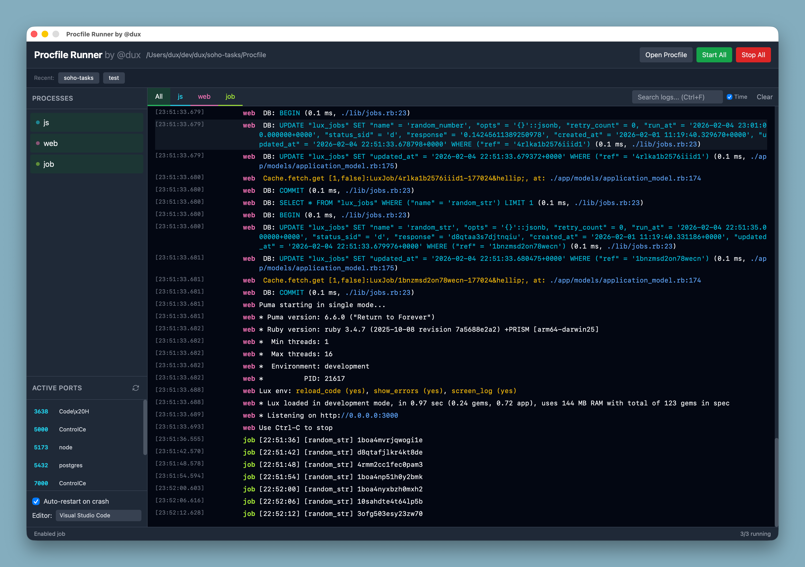
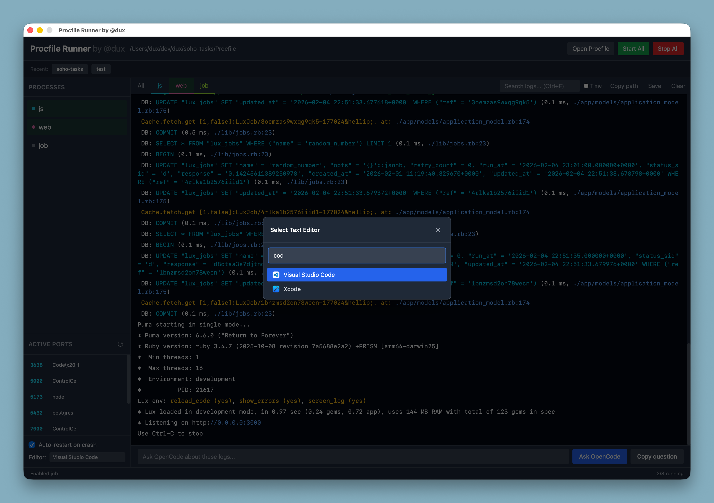

# Procfile Runner

A native desktop application for managing multiple processes defined in a Procfile. Built with [Wails](https://wails.io/) (Go + JavaScript), providing a fast and lightweight GUI for running development services.



## Features

### Process Management
- **Start/Stop Individual Processes** - Control each process independently
- **Start/Stop All** - Batch control with a single click
- **Restart Processes** - Quick restart without manual stop/start
- **Auto-restart on Crash** - Automatically restarts processes that exit with non-zero code (2s delay, configurable)
- **Process Group Killing** - Properly kills child processes on Unix systems (SIGTERM then SIGKILL)
- **Orphan Process Cleanup** - Automatically cleans up leftover processes from previous sessions
- **Working Directory** - Processes run in the Procfile's directory
- **Graceful Shutdown** - All processes stopped when app closes

### Procfile Support
- Standard `name: command` format
- Comment lines with `#`
- **Disabled Processes** - Commented-out processes shown as "disabled" with click-to-enable
- Auto-detection and loading of `.env` files from the same directory
- **Environment Variable Injection** - .env variables passed to all spawned processes
- **Quote Handling** - Properly handles single and double quoted values in .env

### Log Management
- **Real-time Log Streaming** - Live stdout/stderr output
- **Color-coded Output** - 12 distinct colors for easy process identification
- **Full ANSI Support** - Colors, bold, italic, underline, dim text
- **Stderr Highlighting** - Errors shown in red
- **Process Tabs** - View all logs or filter by process
- **Hide/Show Process Output** - Toggle visibility of specific processes in "All" view
- **Search Logs** - Filter with search query, shows context around matches
- **Timestamps** - Optional timestamp display
- **Save/Copy Logs** - Export logs to file or clipboard
- **10,000 Line Buffer** - Keeps last 10,000 log lines in memory
- **Auto-scroll** - Automatically scrolls to new output when near bottom

### Port Management
- **Active Port Scanner** - View processes listening on ports 3000-9000
- **Kill Port** - Terminate processes by port number
- **Process Info** - See command and name for each listening port

### Editor Integration
- **Text Editor Picker** - Choose from installed macOS applications
- **Clickable File Paths** - Click `path/file.go:42` in logs to open in editor
- **Line Number Support** - Jump directly to the error line
- **Editor Support** - VS Code, Cursor, Sublime Text, TextMate, and more

### OpenCode AI Integration
- **Ask OpenCode** - Send logs to OpenCode AI assistant for debugging help
- **Copy Question** - Copy formatted question with log file path to clipboard for any LLM
- **Context Injection** - Automatically includes last 200 log lines
- **Model Detection** - Remembers last used OpenCode model
- **Terminal Support** - Opens in iTerm2 (preferred) or Terminal.app

### Recent Projects
- Quick access to recently opened Procfiles
- Shows project name from directory
- Supports Procfile suffixes (e.g., `Procfile.dev` shown as "project (dev)")
- Keeps last 10 projects

### UI Features
- **Status Bar** - Shows current status and running process count (X/Y running)
- **Toast Notifications** - Center-screen temporary messages for actions
- **App Icon Display** - Shows application icons in editor picker
- **Dark Theme** - Clean dark gray interface
- **Cross-platform Shell** - Uses `sh -c` on Unix, `cmd /C` on Windows

## Keyboard Shortcuts

| Shortcut | Action |
|----------|--------|
| `Cmd/Ctrl + O` | Open Procfile |
| `Cmd/Ctrl + F` | Focus search |
| `Cmd/Ctrl + L` | Clear logs |
| `Cmd/Ctrl + Shift + A` | Start all processes |
| `Cmd/Ctrl + Shift + S` | Stop all processes |
| `Cmd/Ctrl + Shift + R` | Restart all processes |
| `Escape` | Clear search / blur input |

## Installation

### Homebrew (macOS)

```bash
brew tap dux/procfile-runner https://github.com/dux/procfile-runner
brew install --cask procfile-runner

# Allow app to run (removes quarantine)
xattr -d com.apple.quarantine "/Applications/Procfile Runner.app"
```

### Manual Download

1. Download the latest `.zip` from [GitHub Releases](https://github.com/dux/procfile-runner/releases)
2. Extract and move `Procfile Runner.app` to `/Applications`
3. Remove macOS quarantine (required for unsigned apps):

```bash
xattr -d com.apple.quarantine "/Applications/Procfile Runner.app"
```

### Build from Source

**Prerequisites:**
- Go 1.23+
- Node.js 18+
- [Wails CLI](https://wails.io/docs/gettingstarted/installation)

```bash
# Install dependencies
make install

# Development mode with hot reload
make dev

# Build production binary
make build

# Build for specific platform
make build-darwin   # macOS universal
make build-linux    # Linux amd64
make build-windows  # Windows amd64
```

## Usage

1. Launch the application
2. Click "Open Procfile" or press `Cmd/Ctrl + O`
3. Select your Procfile (e.g., `Procfile`, `Procfile.dev`)
4. Click individual processes or "Start All" to run

### CLI Usage

You can also open a Procfile directly from the command line:

```bash
# Open with specific Procfile
procfile-runner ./Procfile
procfile-runner /path/to/project/Procfile.dev

# Or if installed as macOS app
open -a "Procfile Runner" ./Procfile
```

### Example Procfile

```procfile
# Main services
web: bundle exec rails server -p 3000
worker: bundle exec sidekiq
webpack: bin/webpack-dev-server

# Disabled by default (uncomment to enable)
# redis: redis-server
```

### Environment Variables

Place a `.env` file in the same directory as your Procfile:

```env
DATABASE_URL="postgres://localhost/myapp"
REDIS_URL="redis://localhost:6379"
SECRET_KEY=abc123
```

The app automatically loads and injects these variables into all spawned processes.

## Configuration

Settings are stored in `~/.config/procfile-runner/`:
- `recent_projects.json` - Recently opened Procfiles
- `settings.json` - User preferences (text editor)
- `sessions.txt` - Process tracking for orphan cleanup

## Development

```bash
make dev           # Run in dev mode with hot reload
make test          # Run tests
make test-short    # Run tests (skip integration)
make fmt           # Format Go code
make lint          # Lint Go code
make generate      # Regenerate Wails bindings
make clean         # Remove build artifacts
```

## Tech Stack

**Backend**
- Go 1.23
- Wails v2 - Desktop application framework

**Frontend**
- Vanilla JavaScript
- TailwindCSS
- Vite

## Screenshots



## Author

Dino Reic ([@dux](https://github.com/dux))

## License

MIT
